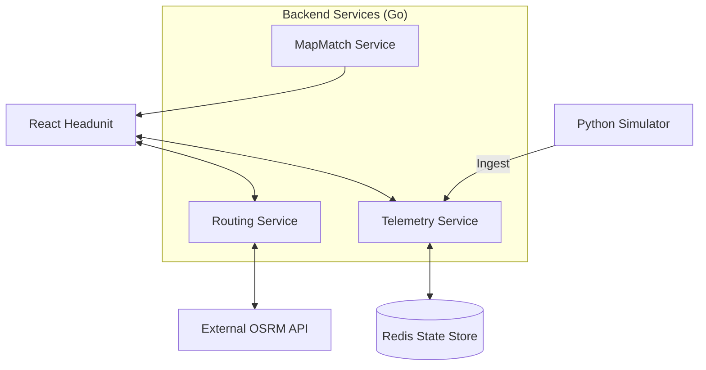

# System Architecture & Design 📐

NaviFly follows a distributed microservices architecture designed for scalability, low latency, and modularity.

## 🧩 Architectural Component Model

## 🧠 Service Breakdown

### 1. React Headunit (Frontend)
- **Aesthetics**: Premium Glassmorphism UI designed for automotive/fleet use-cases.
- **Navigation**: Uses a custom **Cinematic Route Loader** to provide visual feedback during path calculation.
- **State Mgmt**: React Context API (`RouteContext`) for unified vehicle and navigation state.

### 2. Routing Service (Go)
- **A* Algorithm**: Implements a custom graph-based pathfinder for local Arizona nodes.
- **Hybrid Strategy**: Operates in OSRM Proxy mode for real-world geometry but fails back to local high-fidelity interpolation (100 pts) if OSRM is slow (2s timeout).
- **Smart Caching**: Hardcoded high-resolution geometry for key routes (e.g., I-10 PHX-TUC) to guarantee performance.

### 3. Telemetry Service (Go)
- **Real-Time Pipeline**: Ingests vehicle pings (Lat, Lon, Speed, Heading).
- **Redis Backend**: Uses Redis for `vehicle:ID` latest state and `history:ID` capped lists (last 100 pings).
- **Concurrency**: Leverages Go routines for non-blocking persistence.

### 4. Simulator (Python)
- **Movement Physics**: Simulates vehicle acceleration, average speed, and random service breaks.
- **Feedback Loop**: Continuously updates via the Telemetry API.

## 🔐 Design Principles
1. **Offline Resiliency**: Every service features local fallbacks (e.g., Routing falls back to local graphs if OSRM is unreachable).
2. **Speed-First**: Critical paths (like OSRM calls) have strict timeouts (2s) to prevent UI freezing.
3. **Stateless Logic**: Services are stateless, relying on Redis for cross-service synchronization.
