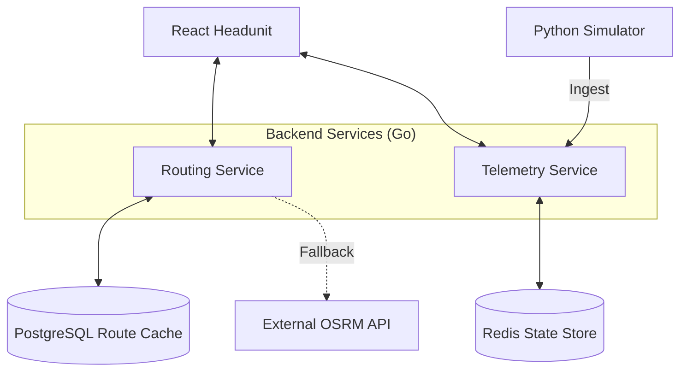

# System Architecture & Design 📐

NaviFly follows a distributed microservices architecture designed for scalability, low latency, and modularity.

## 🧩 Architectural Component Model

## 🧠 Service Breakdown

### 1. React Headunit (Frontend)
- **Aesthetics**: Premium Glassmorphism UI designed for automotive/fleet use-cases.
- **Navigation**: Uses a custom **Cinematic Route Loader** to provide visual feedback during path calculation.
- **State Mgmt**: React Context API (`RouteContext`) for unified vehicle and navigation state.

### 2. Routing Service (Go)
- **Persistence First**: Every route request is first checked against the **PostgreSQL** cache.
- **Real Road Geometry**: Instead of interpolations, we fetch actual road coordinates from OSRM and store them as `jsonb` blobs.
- **Automatic Pre-calculation**: On startup, a background worker populates the database with 600+ Arizona city-to-city route pairs, ensuring instant load times and offline readiness.

### 3. Telemetry Service (Go)
- **Real-Time Pipeline**: Ingests vehicle pings (Lat, Lon, Speed, Heading).
- **Redis Backend**: Uses Redis for `vehicle:ID` latest state and historical tracking.
- **Concurrency**: Leverages Go routines for non-blocking telemetry ingestion.

### 4. Simulator (Python)
- **Movement Physics**: Simulates vehicle acceleration, average speed, and random service breaks.
- **Feedback Loop**: Continuously updates via the Telemetry API.

## 🔐 Design Principles
1. **Offline Resiliency**: Every service features local fallbacks (e.g., Routing falls back to local graphs if OSRM is unreachable).
2. **Speed-First**: Critical paths (like OSRM calls) have strict timeouts (2s) to prevent UI freezing.
3. **Stateless Logic**: Services are stateless, relying on Redis for cross-service synchronization.
